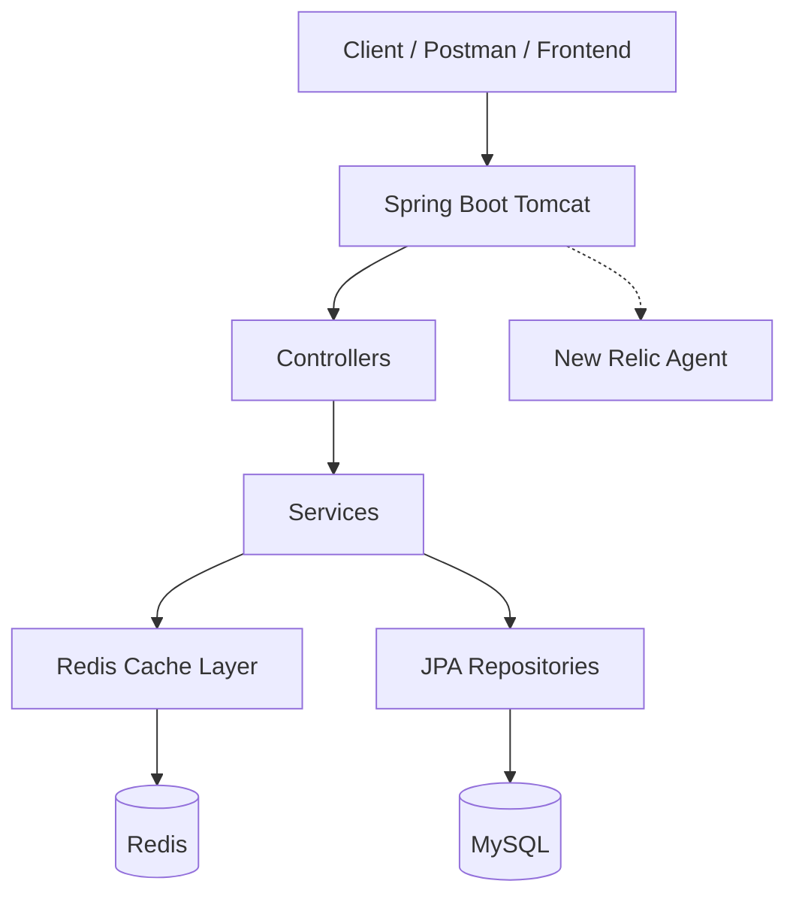
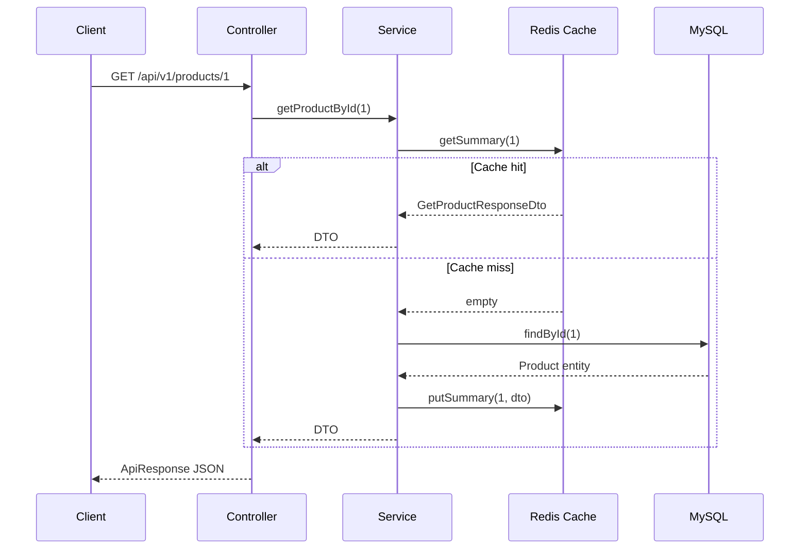
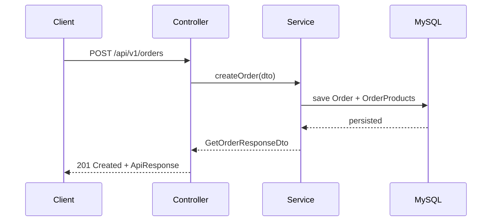
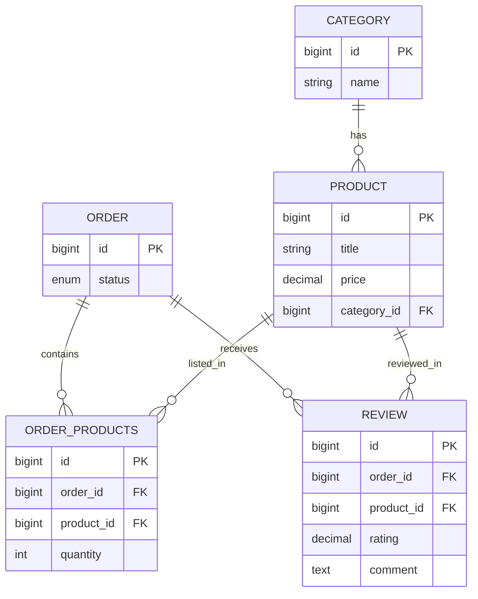

# NexusCommerce — Project Documentation

Complete reference for setup, technology stack, architecture, API flows, request payloads, Redis caching, observability, and real-world usage scenarios.

---

## Table of contents

1. [Overview](#1-overview)
2. [Technologies used](#2-technologies-used)
3. [Environment setup](#3-environment-setup)
4. [Application configuration](#4-application-configuration)
5. [Running the project](#5-running-the-project)
6. [Architecture and request flow](#6-architecture-and-request-flow)
7. [Domain model](#7-domain-model)
8. [Redis caching](#8-redis-caching)
9. [Observability (New Relic)](#9-observability-new-relic)
10. [API reference and payloads](#10-api-reference-and-payloads)
11. [Real-life scenarios](#11-real-life-scenarios)
12. [Error handling](#12-error-handling)
13. [Manual testing checklist](#13-manual-testing-checklist)

---

## 1. Overview

**NexusCommerce** is a Spring Boot REST backend for a small e-commerce platform. It manages:

- **Categories** — product groupings (e.g. Electronics)
- **Products** — catalogue items linked to a category
- **Orders** — purchases with line items (product + quantity)
- **Reviews** — post-purchase feedback tied to a specific order and product

All REST responses use a consistent **`ApiResponse<T>`** envelope. Read-heavy product, order, category, and review endpoints use **Redis** cache-aside (1-minute TTL). **MySQL** is the system of record; **Flyway** applies schema migrations on startup.

**Base URL:** `http://localhost:<PORT>/api/v1` (default `PORT` from `.env`, commonly `3001`).

---

## 2. Technologies used

| Technology | Role in NexusCommerce | Version (project) |
|------------|----------------------|-------------------|
| **Java** | Runtime | 21 |
| **Spring Boot** | Web, DI, auto-configuration | 4.0.2 |
| **Spring WebMVC** | REST controllers | (via starter) |
| **Spring Data JPA** | Repositories, ORM | (via starter) |
| **Hibernate** | JPA provider, `ddl-auto: validate` | 7.x |
| **MySQL** | Primary database | 8.x+ compatible |
| **Flyway** | Versioned SQL migrations | (via starter) |
| **Redis** | Read-through cache for GET APIs | Spring Data Redis + Jedis 7.2 |
| **Lombok** | Boilerplate reduction | compileOnly |
| **springdoc-openapi** | Swagger UI / OpenAPI 3 | 2.8.5 |
| **Gradle** | Build and `bootRun` | 9.x wrapper |
| **New Relic Java agent** | APM on `bootRun` | `newrelic/` directory |
| **Jackson** | JSON (API + Redis serialization) | (Spring Boot managed) |

---

## 3. Environment setup

### 3.1 Prerequisites

Install on your machine:

| Tool | Purpose |
|------|---------|
| **JDK 21** | Compile and run |
| **MySQL** | Database server |
| **Redis** | Cache server |
| **Git** | Clone repo (optional) |

Verify:

```bash
java -version    # should show 21
mysql --version
redis-cli --version
```

### 3.2 MySQL setup

1. Start MySQL service.
2. Create database:

```sql
CREATE DATABASE nexuscommerce CHARACTER SET utf8mb4 COLLATE utf8mb4_unicode_ci;
```

3. Ensure a user can connect to `localhost:3306` with rights on `nexuscommerce`.

**Tables** are created by **Flyway** on first app start (`V1`–`V4` under `src/main/resources/db/migration/`).

### 3.3 Redis setup

1. Start Redis (default port **6379**):

```bash
# macOS (Homebrew example)
brew services start redis

# or foreground
redis-server
```

2. Verify:

```bash
redis-cli ping
# PONG
```

### 3.4 Project configuration file (`.env`)

Create `.env` in the project root (not committed if in `.gitignore`):

```properties
PORT=3001
username=your_mysql_user
password=your_mysql_password
redis_port=6379
```

Spring loads it via `spring.config.import: optional:file:.env[.properties]` in `application.yml`.

### 3.5 New Relic (optional)

- Agent JAR and config: `newrelic/newrelic.jar`, `newrelic/newrelic.yml`
- `app_name` is **NexusCommerce**
- Set **license key** in `newrelic.yml` or env (e.g. `NEW_RELIC_LICENSE_KEY`); do not commit secrets
- `./gradlew bootRun` attaches `-javaagent:newrelic/newrelic.jar` (see `build.gradle`)
- To run **without** New Relic, remove or override `bootRun` `jvmArgs` in Gradle/IDE

---

## 4. Application configuration

| Property | Source | Description |
|----------|--------|-------------|
| `server.port` | `${PORT}` | HTTP port |
| `spring.datasource.url` | `application.yml` | `jdbc:mysql://localhost:3306/nexuscommerce` |
| `spring.datasource.username` | `${username}` | MySQL user |
| `spring.datasource.password` | `${password}` | MySQL password |
| `spring.data.redis.host` | `application.yml` | `localhost` |
| `spring.data.redis.port` | `${redis_port}` | Redis port |
| `spring.jpa.hibernate.ddl-auto` | `validate` | Schema managed by Flyway only |
| `spring.jpa.show-sql` | `true` | SQL in logs (dev-friendly) |
| `spring.flyway.enabled` | `true` | Runs migrations on startup |

---

## 5. Running the project

```bash
cd NexusCommerce
./gradlew bootRun
```

**Swagger UI:** `http://localhost:<PORT>/swagger-ui/index.html`  
**OpenAPI JSON:** `http://localhost:<PORT>/v3/api-docs`

**Tests:**

```bash
./gradlew test
```

---

## 6. Architecture and request flow

### 6.1 High-level architecture



### 6.2 Layered flow (single GET request)



### 6.3 Typical write flow (no cache on write)



> **Note:** Create/update/delete do not invalidate Redis yet. Cached GETs may be stale until TTL (~1 min) expires or keys are cleared manually.

### 6.4 Project package layout

```
com.example.nexusCommerce/
├── controllers/     REST API
├── services/        Business logic
│   └── cache/       ProductRedisCache, OrderRedisCache, CategoryRedisCache, ReviewRedisCache
├── repositories/  Spring Data JPA
├── schema/          Entities (Category, Product, Order, OrderProducts, Review)
├── dtos/            Request/response objects
├── adapters/        Entity ↔ DTO mapping (orders, reviews)
├── exceptions/      Custom exceptions + GlobalExceptionHandler
├── configs/         Swagger/OpenAPI
└── utils/           ApiResponse wrapper
```

---

## 7. Domain model



**Review rules:**

- Product must exist on the order (line item).
- At most **one review per (orderId, productId)**.
- Rating: **> 0** and **≤ 10**.

---

## 8. Redis caching

### 8.1 Pattern

**Cache-aside:** service checks Redis → on miss, loads DB → stores JSON in Redis → returns.

- Serialization: **Jackson** (`ObjectMapper`) to JSON strings in Redis
- TTL: **1 minute** on `put` operations
- Logs: `Cache miss` / `Cache hit` in application logs

### 8.2 Key reference

| Domain | Service method | Redis key pattern |
|--------|----------------|-------------------|
| Product | `getAllProducts` | `product:summary:all` |
| Product | `getProductById` | `product:summary:{id}` |
| Product | `getProductWithDetailsById` | `product:details:{id}` |
| Product | `findByCategory` | `product:category:{normalizedName}` |
| Product | `getUniqueCategories` | `product:unique-categories` |
| Category | `getAllCategory` | `category:all` |
| Category | `getCategoryById` | `category:by-id:{id}` |
| Order | `getAllOrders` | `order:all` |
| Order | `getOrderById` | `order:by-id:{id}` |
| Order | `getOrderSummary` | `order:summary:{id}` |
| Review | `getAllReviews` | `review:all` |
| Review | `getReviewById` | `review:by-id:{id}` |
| Review | `getReviewsByProductId` | `review:by-product:{productId}` |
| Review | `getReviewsByOrderId` | `review:by-order:{orderId}` |

Inspect keys:

```bash
redis-cli -p 6379 KEYS "product:*"
redis-cli -p 6379 KEYS "order:*"
redis-cli -p 6379 KEYS "category:*"
redis-cli -p 6379 KEYS "review:*"
```

---

## 9. Observability (New Relic)

| Item | Detail |
|------|--------|
| Activation | `-javaagent:newrelic/newrelic.jar` on `bootRun` |
| App name | `NexusCommerce` in `newrelic.yml` |
| Visibility | HTTP transactions, JDBC/MySQL, JVM metrics, errors |
| Agent logs | `newrelic/logs/newrelic_agent.log` |
| App SQL logs | `spring.jpa.show-sql: true` |

---

## 10. API reference and payloads

### 10.1 Response envelope

**Success:**

```json
{
  "success": true,
  "message": "Human-readable message",
  "error": null,
  "data": { }
}
```

**Error:**

```json
{
  "success": false,
  "message": "Resource Not Found!",
  "error": "Detailed error text",
  "data": null
}
```

---

### 10.2 Categories — `/api/v1/categories`

| Method | Path | Body | Redis |
|--------|------|------|-------|
| GET | `/` | — | Yes |
| GET | `/{id}` | — | Yes |
| POST | `/` | JSON below | No |
| PUT | `/{id}` | JSON below | No |
| DELETE | `/{id}` | — | No |

**POST / PUT body (`CreateCategoryRequestDto`):**

```json
{
  "name": "Electronics"
}
```

**GET examples:**

```bash
curl http://localhost:3001/api/v1/categories
curl http://localhost:3001/api/v1/categories/1
```

---

### 10.3 Products — `/api/v1/products`

| Method | Path | Body / params | Redis |
|--------|------|---------------|-------|
| GET | `/` | — | Yes |
| GET | `/{id}` | — | Yes |
| GET | `/{id}/details` | — | Yes |
| GET | `/search?categoryName=` | query param | Yes |
| GET | `/uniqueCategories` | — | Yes |
| POST | `/` | JSON below | No |
| DELETE | `/{id}` | — | No |

**POST body (`CreateProductRequestDto`):**

```json
{
  "title": "Wireless Headphones",
  "description": "Noise-cancelling over-ear headphones",
  "price": 4999.00,
  "image": "https://example.com/headphones.png",
  "categoryId": 1,
  "rating": 4.5
}
```

**GET examples:**

```bash
curl http://localhost:3001/api/v1/products
curl http://localhost:3001/api/v1/products/1
curl http://localhost:3001/api/v1/products/1/details
curl "http://localhost:3001/api/v1/products/search?categoryName=Electronics"
curl http://localhost:3001/api/v1/products/uniqueCategories
```

**Sample success `data` (GET by id):**

```json
{
  "id": 1,
  "title": "Iphone 17",
  "description": "New iphone 17",
  "price": 80000.00,
  "image": "Dummy image of iphone 17",
  "rating": 4.4
}
```

**Sample success `data` (GET details):**

```json
{
  "id": 1,
  "title": "Iphone 17",
  "description": "New iphone 17",
  "price": 80000.00,
  "image": "Dummy image of iphone 17",
  "rating": 4.4,
  "category": "Electronics"
}
```

---

### 10.4 Orders — `/api/v1/orders`

| Method | Path | Body | Redis |
|--------|------|------|-------|
| GET | `/` | — | Yes |
| GET | `/{id}` | — | Yes |
| GET | `/{id}/summary` | — | Yes |
| POST | `/` | JSON below | No |
| PUT | `/{id}` | JSON below | No |
| DELETE | `/{id}` | — | No |

**POST body (`CreateOrderRequestDto`):**

```json
{
  "orderItems": [
    {
      "productId": 1,
      "quantity": 2
    }
  ]
}
```

**PUT body (`updateOrderRequestDto`):**

```json
{
  "status": "SHIPPED",
  "orderItems": [
    {
      "productId": 1,
      "quantity": 1,
      "action": "ADD"
    }
  ]
}
```

**`action` values (`OrderItemAction`):** `ADD`, `REMOVE`, `INCREMENT`, `DECREMENT`

**`status` values (`OrderStatus`):** `PENDING`, `SHIPPED`, `DELIVERED`, `CANCELLED` (use enum names as strings in JSON)

**GET examples:**

```bash
curl http://localhost:3001/api/v1/orders
curl http://localhost:3001/api/v1/orders/3
curl http://localhost:3001/api/v1/orders/3/summary
```

**Sample POST (create order):**

```bash
curl -X POST http://localhost:3001/api/v1/orders \
  -H "Content-Type: application/json" \
  -d '{"orderItems":[{"productId":1,"quantity":2}]}'
```

---

### 10.5 Reviews — `/api/v1/reviews`

| Method | Path | Body | Redis |
|--------|------|------|-------|
| GET | `/` | — | Yes |
| GET | `/{id}` | — | Yes |
| GET | `/product/{productId}` | — | Yes |
| GET | `/order/{orderId}` | — | Yes |
| POST | `/` | JSON below | No |
| DELETE | `/{id}` | — | No |

**POST body (`CreateReviewRequestDto`):**

```json
{
  "orderId": 3,
  "productId": 1,
  "rating": 8.5,
  "comment": "Great product, fast delivery"
}
```

| Field | Required | Rules |
|-------|----------|-------|
| `orderId` | Yes | Must exist |
| `productId` | Yes | Must exist and be on that order |
| `rating` | Yes | > 0 and ≤ 10 |
| `comment` | No | Trimmed; blank → stored as null |

**GET examples:**

```bash
curl http://localhost:3001/api/v1/reviews
curl http://localhost:3001/api/v1/reviews/1
curl http://localhost:3001/api/v1/reviews/product/1
curl http://localhost:3001/api/v1/reviews/order/3
```

**POST example:**

```bash
curl -X POST http://localhost:3001/api/v1/reviews \
  -H "Content-Type: application/json" \
  -d '{"orderId":3,"productId":1,"rating":9,"comment":"Excellent"}'
```

---

## 11. Real-life scenarios

### Scenario A: New customer browses the catalogue

**Story:** Priya opens the store app and explores products before signing up to buy.

| Step | Action | API |
|------|--------|-----|
| 1 | Load category filters | `GET /products/uniqueCategories` |
| 2 | Browse Electronics | `GET /products/search?categoryName=Electronics` |
| 3 | Open product page | `GET /products/1/details` |
| 4 | Compare price list | `GET /products` |

**Redis:** Repeat step 3 twice — second call should hit `product:details:1` in logs.

---

### Scenario B: Customer places an order

**Story:** Rahul adds an iPhone to cart and checks out (backend creates order with line items).

| Step | Action | API |
|------|--------|-----|
| 1 | Verify product exists | `GET /products/1` |
| 2 | Place order (2 units) | `POST /orders` with `productId: 1, quantity: 2` |
| 3 | View order confirmation | `GET /orders/{id}` |
| 4 | See totals on receipt screen | `GET /orders/{id}/summary` |

**Flow:** POST writes to MySQL only. GET order/summary may be cached; if Rahul updates order status elsewhere, wait for TTL or clear Redis before expecting fresh GET data.

---

### Scenario C: Post-delivery product review

**Story:** After delivery, Rahul rates the iPhone from **that** order only.

| Step | Action | API |
|------|--------|-----|
| 1 | Confirm order id | `GET /orders/3` |
| 2 | Submit review | `POST /reviews` with matching `orderId` + `productId` |
| 3 | Product page shows ratings | `GET /reviews/product/1` |
| 4 | Order history shows feedback | `GET /reviews/order/3` |

**Failure example:** Review for product not on order → **400** `"Product X is not part of order Y"`.  
**Duplicate review** for same order+product → **409**.

---

### Scenario D: Store admin adds a new category and product

**Story:** Admin onboard a “Home & Kitchen” line.

| Step | Action | API |
|------|--------|-----|
| 1 | Create category | `POST /categories` `{"name":"Home & Kitchen"}` |
| 2 | List categories | `GET /categories` |
| 3 | Add product | `POST /products` with new `categoryId` |
| 4 | Verify listing | `GET /products/search?categoryName=Home%20%26%20Kitchen` |

---

### Scenario E: Customer changes mind on an order

**Story:** Order is `PENDING`; customer adds another item via update API.

| Step | Action | API |
|------|--------|-----|
| 1 | Get current order | `GET /orders/{id}` |
| 2 | Add product line | `PUT /orders/{id}` with `action: "ADD"` |
| 3 | Refresh summary | `GET /orders/{id}/summary` |

**PUT payload example:**

```json
{
  "orderItems": [
    {
      "productId": 3,
      "quantity": 1,
      "action": "ADD"
    }
  ]
}
```

---

### Scenario F: Operations team monitors production

**Story:** SRE checks latency and errors after a traffic spike.

| Step | Action |
|------|--------|
| 1 | Run app with New Relic agent (`./gradlew bootRun`) |
| 2 | Open New Relic UI → application **NexusCommerce** |
| 3 | Inspect slow transactions on `GET /products`, JDBC time |
| 4 | Correlate with `newrelic/logs/newrelic_agent.log` if agent fails to connect |

---

### Scenario G: Developer validates Redis in local dev

**Story:** Confirm cache-aside works before release.

| Step | Action |
|------|--------|
| 1 | `redis-cli FLUSHDB` (local only) |
| 2 | `GET /categories` twice → miss then hit |
| 3 | `redis-cli GET category:all` → JSON blob |
| 4 | Repeat for products, orders, reviews |

---

## 12. Error handling

| HTTP status | Exception / case | Example `error` message |
|-------------|------------------|---------------------------|
| **404** | `ResourceNotFoundException` | `Product with id: 99 Not Found!` |
| **409** | `DuplicateResourceException` | `A review already exists for this order and product` |
| **400** | `InvalidRequestException` | `Category name must not be blank!` |
| **500** | Unhandled | `Something went wrong!` + exception message |

---

## 13. Manual testing checklist

Use `PORT=3001` (or your `.env` value).

### Categories (Redis GET)

- [ ] `GET /api/v1/categories` ×2
- [ ] `GET /api/v1/categories/1` ×2

### Products (Redis GET)

- [ ] `GET /api/v1/products` ×2
- [ ] `GET /api/v1/products/1` ×2
- [ ] `GET /api/v1/products/1/details` ×2
- [ ] `GET /api/v1/products/search?categoryName=Electronics` ×2
- [ ] `GET /api/v1/products/uniqueCategories` ×2

### Orders (Redis GET)

- [ ] `POST /api/v1/orders` (seed) → note `data.id`
- [ ] `GET /api/v1/orders` ×2
- [ ] `GET /api/v1/orders/{id}` ×2
- [ ] `GET /api/v1/orders/{id}/summary` ×2

### Reviews (Redis GET)

- [ ] `POST /api/v1/reviews` (valid order + product) → note `data.id`
- [ ] `GET /api/v1/reviews` ×2
- [ ] `GET /api/v1/reviews/{id}` ×2
- [ ] `GET /api/v1/reviews/product/1` ×2
- [ ] `GET /api/v1/reviews/order/{orderId}` ×2

### End-to-end journey (no Redis required on writes)

1. `GET /categories` → `GET /products/search?categoryName=...`
2. `POST /orders` → `GET /orders/{id}/summary`
3. `POST /reviews` → `GET /reviews/product/{productId}`

---

## Document info

| Field | Value |
|-------|--------|
| Application | **NexusCommerce** |
| API version prefix | `/api/v1` |
| Related file | `README.md` (shorter overview) |

For interactive exploration, prefer **Swagger UI** at `/swagger-ui/index.html` after the app is running.
